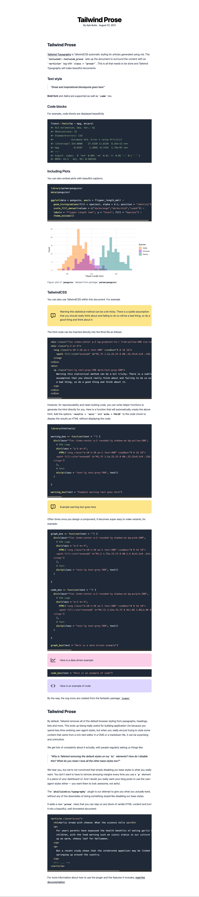

<!-- README.md is generated from README.Rmd. Please edit that file -->

```{r, include = FALSE}
knitr::opts_chunk$set(
  collapse = TRUE,
  comment = "#>",
  fig.path = "man/figures/README-",
  out.width = "100%"
)
```

# tailwindr

<!-- badges: start -->
<!-- badges: end -->

The goal of tailwindr is to ...

## Installation

You can install the development version from [GitHub](https://github.com/) with:

``` r
# install.packages("devtools")
devtools::install_github("kylebutts/tailwindr")
```


## Tailwind CSS

Tailwind CSS is a *utility-based* CSS framework that allows really quick and incredibly customizable styling of html all through classes. Here are some example classes

- `my-4` which sets the margin top and bottom to size `4` (Tailwind has sizes that are consistent across classes. 4 happens to be `1rem`)
- `shadow-sm`/`shadow-md`/`shadow-lg`/`shadow-xl` set a drop shadow on divs
- `text-left`/`text-center`/`text-right` left/center/right- align text.
- `w-#/12` sets a column of width #/12 (similar to bootstrap's grid)
- [Much, much more](https://tailwindcss.com/docs/)

Writing css in Tailwind is incredibly easy too, with the [`@apply`](https://tailwindcss.com/docs/functions-and-directives#apply) directive. For example, lets say you want to create a blue button class, say `.btn-blue`. I can use the `@apply` directive to autmoatically use a bunch of TailwindCSS utility classes:

```css
.btn-blue {
  @apply bg-blue-500 hover:bg-blue-700 text-white;
}
```

After compiling the css, setting `class = "btn-blue"` is equivalent to setting `class = "bg-blue-500 hover:bg-blue-700 text-white"`. 


## `tailwind_prose` Output Format

The `tailwindr::tailwind_prose` Rmarkdown output format makes beautiful typography easy by using uses the css framework TailwindCSS and Tailwing Typography. For more information visit <https://github.com/tailwindlabs/tailwindcss-typography>.

To use this Rmd template, you can use the "From Template" option in RStuidio or use the following in your preamble:

```
---
title: "Template Title"
author: "Your Name"
date: "`r format(Sys.Date(), '%B %d, %Y')`"
output: 
  tailwindr::tailwind_prose:
    highlight: zenburn
    self_contained: false
    slim_css: TRUE
    css: []
---
```


### Example Output 

View it live by clicking on the image

<a href="https://kylebutts.com/tailwindr/">

</a>

### Custom templates

You can also write custom templates to surround the Rmd output in any HTML you want. Look at <https://github.com/kylebutts/tailwindr/tree/gh-pages/ex_custom_theme> for an example, or view it live at <https://kylebutts.com/tailwindr/ex_custom_theme/>


### Details

The parameter 'slim_css' uses PostCSS to strip TailwindCSS to include *only* the css classes that *appear* in the final html document. This is great for keeping files very small, but bad if you are trying to edit through chrome or firefox for example. I recommend putting 'slim_css: false' into the yaml while developing and 'slim_css: true' when ready to finish. This requires [node](https://www.npmjs.com/) (npm) to be installed on your system, but the output document automatically handles compiling all the css.

Custom css is possible by passing objects to the 'css' yaml parameter. Importantly, you can use the `@apply` directives that come with tailwind to easily compile set of classes. See <https://tailwindcss.com/docs/functions-and-directives#apply> for more details. You can create and link css files just as normal, but now you can use all the Tailwind css classes by using `@apply`. When you hit Knit, it will automatically process the CSS for you.

You can also type custom html in Rmd files, so the possibilities are endless...


## `tailwind` Output Format

There is also a `tailwindr::tailwind` output format that can be used for more general design. You can write custom html templates and pass them to the `template` YAML option. The output format works the same as `tailwindr::tailwind_prose` but doesn't include Tailwind Typography. 

## Credits

- [TailwindCSS](https://tailwindcss.com/) and [Tailwind Typography](https://github.com/tailwindlabs/tailwindcss-typography)
